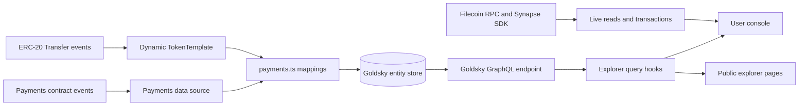
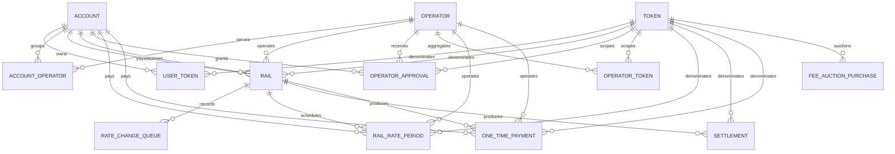
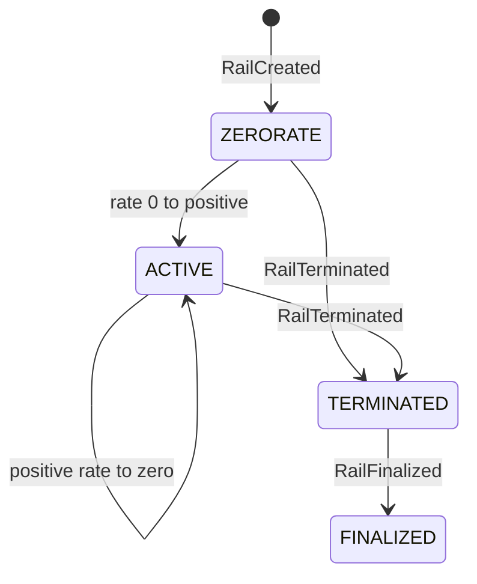
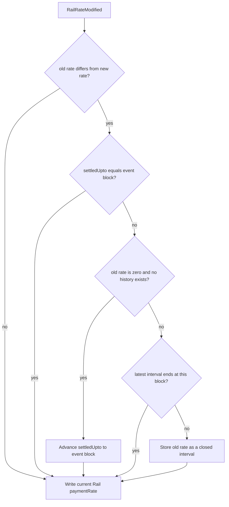
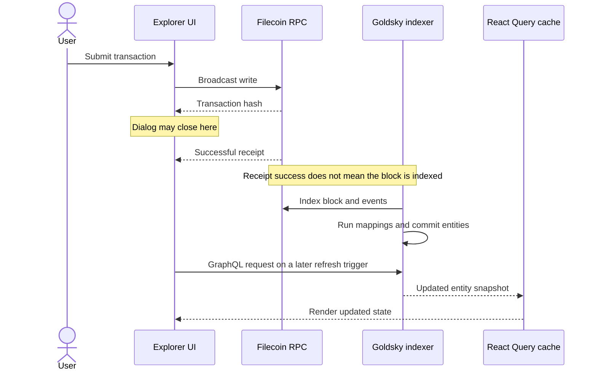

# Filecoin Pay subgraph architecture

This document explains what the Filecoin Pay subgraph indexes, how contract events become entities, and where the Explorer reads those entities. It describes the current implementation, including known gaps that may differ from the intended protocol model.

The authoritative implementation files are:

- [`packages/subgraph/templates/subgraph.template.yaml`](../packages/subgraph/templates/subgraph.template.yaml) for data sources and handlers
- [`packages/subgraph/schemas/schema.v1.graphql`](../packages/subgraph/schemas/schema.v1.graphql) for entities
- [`packages/subgraph/src/payments.ts`](../packages/subgraph/src/payments.ts) for event mappings
- [`packages/subgraph/src/utils/helpers.ts`](../packages/subgraph/src/utils/helpers.ts) for entity creation and accounting helpers
- [`apps/explorer/src/services/grapql/queries.ts`](../apps/explorer/src/services/grapql/queries.ts) for Explorer GraphQL queries

## System boundary

The Payments contract is the source of truth. The subgraph is an event-derived projection built for discovery, relationships, aggregates, and history. It does not replace live contract reads for transaction-critical decisions.



Goldsky hosts a standard graph-node-compatible, code-based subgraph. The custom mappings are needed because the indexed model combines current state, historical rows, and accounting derived across several events.

## Build and network configuration

The checked-in schema and manifest templates are source files. `schema.graphql`, `subgraph.yaml`, `generated/`, and `build/` are generated artifacts.

`pnpm build` runs this chain:

1. Remove old generated bindings.
2. Copy `schemas/schema.${VERSION:-v1}.graphql` to `schema.graphql`.
3. Render `templates/subgraph.template.yaml` with `config/${NETWORK:-calibration}.json`.
4. Run Graph code generation.
5. Compile the AssemblyScript mappings to Wasm.

The current network inputs are:

| Config | Graph network | Payments address | Start block |
| --- | --- | --- | ---: |
| [`mainnet.json`](../packages/subgraph/config/mainnet.json) | `filecoin` | `0x23b1e018F08BB982348b15a86ee926eEBf7F4DAa` | 5,421,336 |
| [`calibration.json`](../packages/subgraph/config/calibration.json) | `filecoin-testnet` | `0x09a0fDc2723fAd1A7b8e3e00eE5DF73841df55a0` | 3,120,649 |

The manifest uses `specVersion: 1.2.0`, mapping API `0.0.9`, automatic pruning, and event handlers only. Contract calls occur inside mappings only when a new ERC-20 `Token` needs `name`, `symbol`, and `decimals`; the calls use `try_` methods with fallback values.

## Data sources

### Payments data source

The static `Payments` source starts at the configured deployment block and indexes eleven contract events.

| Event | Main entity effects |
| --- | --- |
| `DepositRecorded` | Creates or updates `Account`, `Token`, and `UserToken`; starts the ERC-20 template on the token's first deposit |
| `WithdrawRecorded` | Reduces `UserToken.funds` and token-wide funds; updates deposit/withdrawal volume |
| `AccountLockupSettled` | Replaces the account-token lockup checkpoint with values emitted by the contract |
| `OperatorApprovalUpdated` | Creates or updates `OperatorApproval`; creates related entities and updates the payer/operator approval counters |
| `RailCreated` | Creates `Rail` and its initial zero-rate `RailRatePeriod`; creates participant accounts and updates protocol-wide and payer/operator rail counters |
| `RailRateModified` | Updates current rail rate, the analytics rate timeline, settlement queue history, rate usage, streaming lockup, and the first payer/operator activation |
| `RailLockupModified` | Updates fixed/period lockup and corresponding approval, operator-token, and token lockup totals |
| `RailTerminated` | Marks the rail terminated, caps its current rate period at `endEpoch`, removes its active rate from lockup totals, and decrements the payer/operator active-rail count when applicable |
| `RailSettled` | Creates `Settlement`; moves payer, payee, and fee-recipient balances; updates rail, token, and operator totals |
| `RailOneTimePaymentProcessed` | Creates a payer/operator-denormalized `OneTimePayment`; moves balances; consumes fixed lockup and approval allowance |
| `RailFinalized` | Marks the rail finalized and releases its remaining indexed lockup usage |

Most handlers also update protocol, daily, weekly, token, or operator metrics through `MetricsCollectionOrchestrator`.

### Dynamic ERC-20 template

An ERC-20 `TokenTemplate` begins indexing when the first deposit for a non-native token is recorded. Native FIL uses the zero address and does not create a token template.

The template observes `Transfer` events whose indexed `from` topic is the Payments contract. The handler records a `FeeAuctionPurchase` only when all of these conditions hold:

- the transfer originates from the Payments contract;
- the top-level transaction also targets the Payments contract;
- the calldata selector matches `burnForFees(address,address,uint256)`.

This distinguishes fee-auction purchases from withdrawals without transaction tracing. Router-mediated calls and transfers emitted before the template starts are outside this index.

## Entity model



### Current-state entities

These entities are mutable projections. Their IDs make each row represent a stable domain object rather than an individual event.

| Entity | ID | Meaning |
| --- | --- | --- |
| `Account` | account address | Explorer identity and counters for rails, token positions, and approvals |
| `AccountOperator` | payer address + operator address | One payer's indexed service relationship, with lifetime and active rail and approval counts |
| `UserToken` | account address + token address | One account's current internal balance, lockup checkpoint, paid amount, and collected amount |
| `Token` | token address | Token metadata and protocol-wide token aggregates |
| `Operator` | operator address | Operator identity and relationship counters |
| `OperatorApproval` | client + operator + token | Current approval and usage for one client/operator/token tuple |
| `OperatorToken` | operator + token | Token-denominated totals aggregated across an operator's clients |
| `Rail` | byte representation of rail ID | Current rail configuration, lifecycle state, participants, and cumulative totals |
| `RailRatePeriod` | opening event transaction hash + log index | Event-derived scheduled-rate interval, denormalized for payer, operator, and token queries |
| `RateChangeQueue` | rail ID + interval start epoch | A persistent closed prior-rate interval used to reconstruct settlement lockup reduction |

Relationships such as `Account.userTokens` and `Rail.settlements` use `@derivedFrom`. The child stores the foreign key; the parent collection is resolved at query time.

### Immutable event records

`Settlement`, `OneTimePayment`, and `FeeAuctionPurchase` are immutable. Their IDs combine transaction hash and log index, so several relevant events in one transaction remain distinct. `OneTimePayment` stores the rail's payer, operator, and token so account spend can be paged and filtered without nested rail collections.

These rows retain transaction-level history while mutable entities hold current state and cumulative totals.

### Metrics entities

`PaymentsMetric`, `DailyMetric`, `WeeklyMetric`, `DailyTokenMetric`, and `DailyOperatorMetric` are mutable aggregate buckets. They support dashboards and leaderboards, not the user console's funds, rails, or approvals sections.

## Account and token accounting

`UserToken` is the account-level financial projection used by the console:

- `funds` is the current internal Payments balance.
- `lockupCurrent` and `lockupRate` form a checkpointed lockup projection.
- `lockupLastSettledUntilEpoch` and `lockupLastSettledUntilTimestamp` anchor that projection.
- `payout` accumulates gross amounts paid by this account as payer.
- `fundsCollected` accumulates net amounts received by this account as payee.

Deposits increase `UserToken.funds`. Withdrawals reduce it. Settlements and one-time payments reduce the payer by the gross total, credit the payee with the net amount, and credit the service-fee recipient with operator commission. Network fees leave user balances; for ERC-20 tokens they accumulate in `Token.accumulatedFees` until a fee auction purchase draws the value down.

`Token.userFunds` follows the sum of user balances. Other `Token` fields have narrower current behavior than their names may suggest:

- `volume` changes on deposits and withdrawals, not settlements or one-time payments.
- `operatorCommission` is initialized but is not updated by the current mappings.
- `totalUsers` increments when a new `UserToken` row is created; it is a token-position count, not a count of accounts with a positive balance.

### Lockup projection

The subgraph stores a checkpoint rather than recalculating every account on every block:

```text
projected lockup = lockupCurrent + lockupRate * (targetEpoch - lockupLastSettledUntilEpoch)
```

`AccountLockupSettled` replaces the emitted account-token checkpoint. Rail rate, lockup, termination, settlement, and finalization events adjust related aggregates between checkpoints.

The user console advances its displayed lockup from the indexed timestamp once per 30-second Filecoin epoch. This makes time progression responsive, but the base checkpoint remains as fresh as the last GraphQL response.

## Rail lifecycle

Every rail is created with zero rate and `ZERORATE` state. The current mapping recognizes the first zero-to-positive transition as activation.



The `ACTIVE --> ACTIVE` self-transition documents current indexed behavior: a later positive-to-zero rate change updates `paymentRate` but does not return the state to `ZERORATE`. The console uses `state` when deciding whether a zero-rate rail has unsettled positive history, so this mismatch can affect settlement discovery.

Termination stores `endEpoch` and removes the rail's rate from active lockup rates. Finalization releases the remaining fixed and streaming lockup usage and changes the state to `FINALIZED`.

## Historical rate intervals

The subgraph keeps two rate projections because settlement accounting and analytics have different completeness rules.

### Scheduled-rate timeline

`RailRatePeriod` is the event-derived analytics timeline. Every rail starts with a zero-rate period whose ID comes from the `RailCreated` transaction hash and log index. `Rail.createdAtEpoch` stores the creation block, and `Rail.currentRatePeriod` points to the period that owns the current rate.

Periods use the interval `(startEpoch, untilEpoch]`. A rate change in block B closes the prior period at B and starts the replacement at B, so the old rate applies through B and the new rate applies from B + 1. When creation and activation or several changes occur in one block, the mapping updates that block's existing period instead of creating empty intervals. A no-op event where `oldRate == newRate` does not touch the timeline.

Before a real change, the mapping requires the current period to exist, match `oldRate`, and start no later than the event block. A violation aborts indexing instead of continuing with a corrupt timeline.

Termination caps the current period at the emitted inclusive `endEpoch`. A later permitted decrease before that epoch splits the period at the change block and copies the cap to the replacement. `RailSettled` and `RailFinalized` leave this timeline unchanged.

The payer, operator, and token foreign keys are copied onto every period. This supports top-level, cursor-paged spend queries without loading rails and their nested histories.

### Settlement rate queue

The contract's rate queue is settlement bookkeeping that can dequeue processed rates. The subgraph's `RateChangeQueue` is a persistent projection of that accounting model: created rows are not deleted after settlement.

Each row describes a closed prior-rate interval:

```text
(startEpoch, untilEpoch] at rate
```

The new current rate is stored on `Rail.paymentRate`, not in the queue. Unlike `RailRatePeriod`, the queue intentionally omits transitions that settlement accounting does not need.



The omissions are intentional:

- the initial zero-rate period has no payable value, so it advances the settlement checkpoint instead of creating a row;
- a rate already settled at the modification block does not need another historical interval;
- several transitions in one epoch do not create competing rows with the same start epoch;
- the open current period stays on `Rail` until a later change closes it.

During `RailSettled`, the mapping clips every stored interval to the settlement window, adds the uncovered duration at the current rail rate, and subtracts that result from token lockup. Persistent history is therefore used for later accounting; it is not a verbatim log of every `RailRateModified` event.

## Operator approvals

`OperatorApproval` represents one client's current approval for one operator and token. `OperatorApprovalUpdated` overwrites the absolute allowance, approval flag, and maximum lockup period while retaining usage accumulated from rails. Revocation sets `isApproved` to false but does not delete the row.

`AccountOperator` groups those token-specific approvals and payer-side rails into one service relationship. It is created by the first rail or approval for a payer/operator pair. `totalRails` and `totalApprovals` are lifetime counts. `totalActiveApprovals` follows the current approval flags. `totalActiveRails` follows the indexed `Rail.state`, so an activated rail remains active when its payment rate returns to zero and leaves the count only when terminated.

A service-discovery query should include relationships where `totalRails > 0` or `totalActiveApprovals > 0`. This includes authorization-only services and services with historical rails while excluding revoked-only rows with no rails. For cursor pagination, order by `id` and advance with `id_gt`; within one payer prefix, that is operator-address order.

`rateUsage` tracks the sum of applicable rail payment rates. `lockupUsage` tracks fixed lockup plus rate multiplied by lockup period. Rail changes apply deltas, and finalization releases remaining lockup usage. A one-time payment consumes both fixed lockup and lockup allowance.

The rate helpers mutate loaded entities without saving them directly. `handleRailRateModified` owns persistence for both paths:

- when effective lockup is positive, the following lockup helper saves the same loaded entities;
- when effective lockup is zero, explicit saves at the end of the handler persist the rate changes.

This coupling is easy to misread, but the current handler does persist both cases.

`OperatorToken` is different: it aggregates an operator across clients for one token. Settlement, commission, volume, and usage fields are aggregated. Its allowance fields are currently overwritten with the latest client's approval event, so they are neither per-client values nor correct operator-wide totals.

## How the Explorer consumes the subgraph

The Explorer selects a public Goldsky endpoint from `NEXT_PUBLIC_SUBGRAPH_URL_MAINNET` or `NEXT_PUBLIC_SUBGRAPH_URL_CALIBRATION`. [`useGraphQLQuery`](../apps/explorer/src/hooks/useGraphQLQuery.ts) sends requests directly from the browser and appends the selected network to every React Query cache key.

### User console

The console first queries `Account`. A missing indexed account prevents the funds, rails, and approvals sections from mounting and shows the first-use actions instead.

| Console section | GraphQL entities and fields | Live-chain complement |
| --- | --- | --- |
| Account gate | `Account` identity and counters | Wallet connection supplies the address and network |
| Funds | Up to 100 `UserToken` rows ordered by funds, with nested `Token` metadata | Withdrawal dialog polls `getAccountInfoIfSettled`; deposit dialogs read wallet balances and allowances |
| Rails | Ten `Rail` rows per page with participants, token, current state, rates, totals, and the latest positive `RateChangeQueue` interval | Current block is watched; settlement amounts come from Synapse SDK contract reads |
| Authorized Services (current UI) | First ten `OperatorApproval` rows ordered by `rateUsage`, with nested `Operator` and `Token` | Approval writes call `setOperatorApproval` |

The subgraph now exposes `AccountOperator` for the service-list work in #340, but the current Explorer has not switched to it yet. The existing console fetches `UserToken.payout` and `fundsCollected`, but the active funds overview does not render them. It fetches `OperatorApproval.lockupUsage` and `rateUsage`, but the table renders allowances rather than usage; `rateUsage` still controls ordering.

`OperatorToken`, `Settlement`, `OneTimePayment`, `FeeAuctionPurchase`, and metrics entities are not used by the active user-console sections. They serve operator pages, rail-detail history, leaderboards, dashboards, or future views.

### Indexed discovery versus transaction authority

The console deliberately mixes indexed and live sources:

- Subgraph data finds accounts, token positions, rails, participants, approval rows, and historical rate intervals.
- Live block watching supplies the current settlement epoch.
- Synapse SDK reads calculate settlement amounts before submission.
- The withdrawal dialog polls settled account information from the Payments contract every ten seconds while open.
- Transaction hooks submit writes and watch receipts through the connected RPC.

An indexed value should not be treated as transaction-authoritative without a fresh contract read. The current Increase Approval dialog violates this boundary: it adds the requested increase to indexed allowance values, then submits those calculated totals to the absolute `setOperatorApproval` setter. Indexer lag can turn an apparent increase into a lower on-chain value.

## Freshness boundary

There are three independent clocks: transaction confirmation, Goldsky indexing, and browser cache refresh.



The shared `QueryClient` uses React Query defaults. Console account queries set no polling interval. They are stale immediately and normally refetch on mount, window focus, or reconnect, but they do not continuously poll while the page stays mounted and focused.

Most direct transaction flows close on broadcast and do not invalidate their GraphQL queries after receipt. Guided top-up invalidates account and token queries after confirmation, but that single refetch can run before Goldsky has indexed the receipt block and return the old snapshot again.

The Explorer does not query `_meta.block.number` or `hasIndexingErrors`, so it cannot measure its distance from chain head or know when a receipt block is queryable. A shared freshness pattern should model `submitted -> confirmed -> indexed -> rendered`, wait for bounded indexer convergence, invalidate targeted query keys, and expose a syncing state when convergence has not happened yet.

## Known follow-up work

These items describe verified gaps in the current code rather than normal eventual consistency:

1. Define aggregate semantics for `OperatorToken.lockupAllowance` and `rateAllowance`; the latest client event currently overwrites both.
2. Track payer and payee uniqueness independently; the current metrics infer both roles from the shared `Account.totalRails` counter.
3. Fix zero-rate settlement discovery without changing the rail's `ACTIVE` lifecycle state.
4. Replace the Authorized Services approval rows with the payer-scoped `AccountOperator` service list, using the relationship filter and cursor ordering described above.
5. Read current contract approval values before constructing an Increase Approval transaction.
6. Define and apply one receipt-to-indexer freshness pattern across console mutations.

## Verification and maintenance

For mapping or schema changes, run from `packages/subgraph`:

```bash
pnpm build
pnpm test
```

Mapping tests use Matchstick. New accounting behavior should include an event sequence that checks both the directly changed entity and affected aggregates.

After deployment, query the endpoint metadata before Explorer smoke tests:

```graphql
{
  _meta {
    block {
      number
    }
    hasIndexingErrors
  }
}
```

Compare the indexed block with the target network and receipt blocks used in the smoke test. Explorer verification should cover first deposit, account discovery, balance changes, rail settlement, zero-rate transitions, and approval updates.
